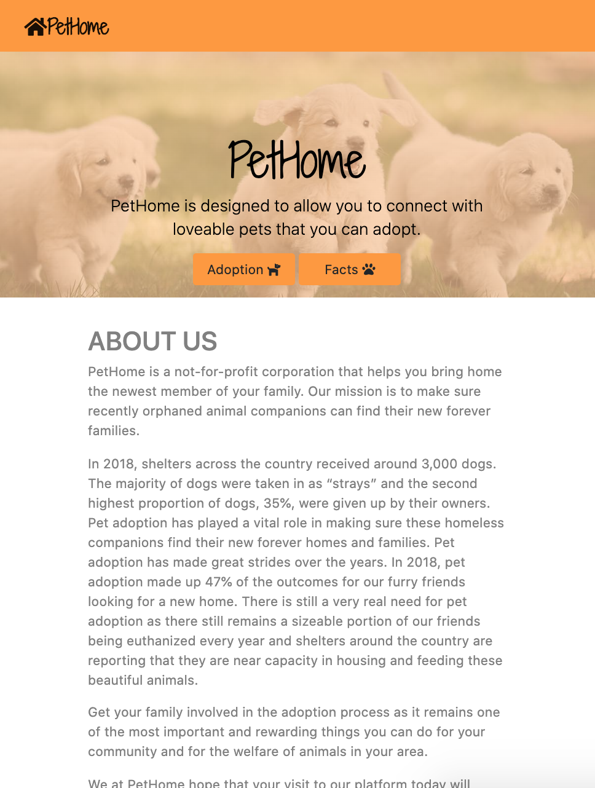
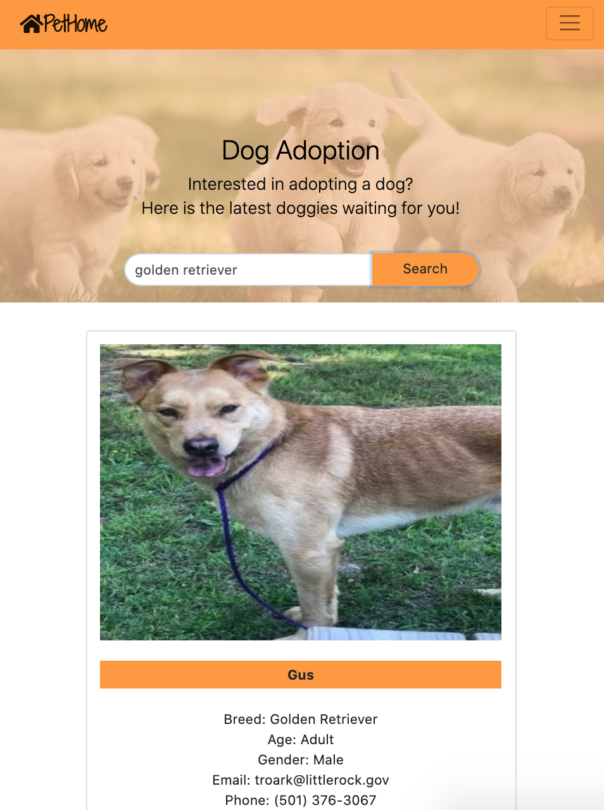

# PetHome
This is the team c0dehot's first project creating a mobile first site.

Deployed URL: https://nuleeannajeon.github.io/PetHome/

## Project:
PetHome was designed to allow people from all over the world to connect with loveable pets that they can adopt. Through our platform, we simplify the process of searching for desired pets based on a variety of characteristics. Our goal is to assist users by creating the most pleasant experience of adopting a pet and bringing it home to its new family.

Why: Pethome was designed to allow people to connect with pets that they can adopt.
The one of the biggest reason why we were kind of interested in this type of website  is that there are still a lot of number of abandoned and homeless dogs in animal shelter and we want to reduce their number and to help families find happiness by adding a new family member.

What: Pethome is a web-based platform that allows users to do two things: 1) Browse and search for dogs that are available for adoption; and 2) Browse and search for additional information on different types of breeds. 

Adoption:Using our quick search function you can enter the desired dog breed and find the dogs that are available for adoption.

Also If there are people who are not sure which breed is right for them, they can use our fact finder to choose the right breed based on a variety of characteristics.
